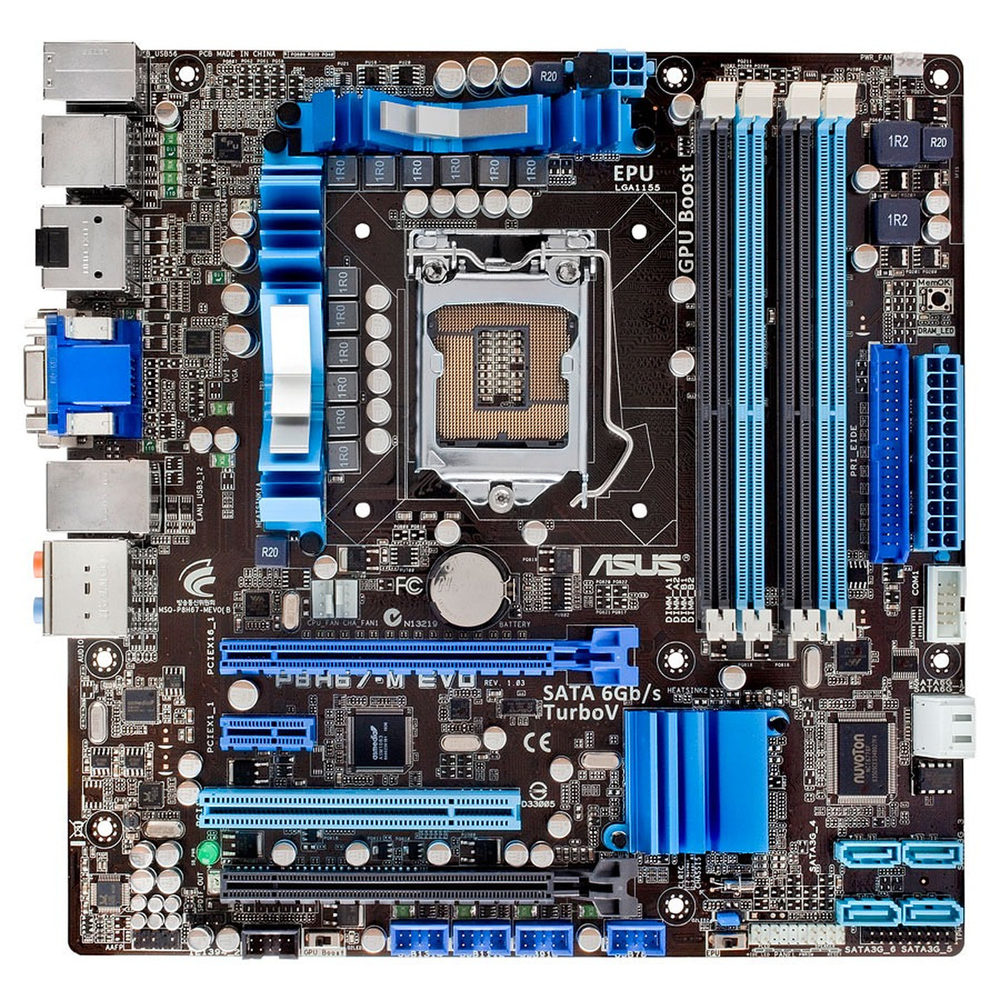

Avui ens han lliurat una torre d’ordinador per diagnosticar i reparar. En primer lloc, hem connectat la torre al corrent elèctric i hi hem connectat el monitor per comprovar el seu funcionament. L’equip era capaç d’engegar-se aparentment amb normalitat, ja que els ventiladors i els indicadors lluminosos funcionaven correctament. Tot i això, l’ordinador no mostrava cap imatge al monitor, fet que indicava que existia algun problema de maquinari.

Per començar el procés de diagnòstic, hem obert completament la torre per accedir als components interns. Hem desconnectat la disquetera de CD, ja que és un component innecessari per a la diagnosi i dificultava l’accés a la resta d’elements interns. Seguidament, hem realitzat una revisió visual general per comprovar que tots els cables i connexions estiguessin correctament col·locats i en bon estat.

Posteriorment, hem procedit a desmuntar el sistema de refrigeració del processador retirant el ventilador de la CPU. Després hem extret el processador amb molta cura per inspeccionar l’estat del sòcol de la placa base. Durant aquesta revisió hem detectat que el socket del processador tenia un pin doblegat i parcialment trencat, la qual cosa representa una avaria greu. Aquest defecte impedeix que el processador faci un contacte correcte amb la placa base, fet que explica que l’ordinador s’engegués però no pogués iniciar el sistema ni mostrar imatge.

Com a intent de reparació, vam provar de redreçar els pins del socket utilitzant un petit tornavís de precisió. Aquesta operació es va fer amb molta precaució per evitar provocar més danys. Tot i això, no vam aconseguir reparar el defecte perquè el pin es trobava completament trencat i no era possible restablir el contacte elèctric necessari.

Pel que fa a la verificació, després d’intentar la reparació vam tornar a muntar provisionalment els components principals i vam provar d’engegar novament l’ordinador. El resultat va ser el mateix que a l’inici: l’equip s’engegava però continuava sense mostrar imatge, confirmant que la incidència no s’havia pogut solucionar.

La solució teòrica per resoldre aquesta avaria seria substituir la placa base per una altra compatible. No obstant això, el fabricant ja no comercialitza aquest model i no es disposa de recanvis adequats, fet que fa que la reparació no sigui viable ni econòmicament ni tècnicament.

Per tant, l’estat final de l’equip és avariat i fora de servei. Finalment, hem documentat tot el procés de diagnòstic, les proves realitzades i el resultat obtingut.